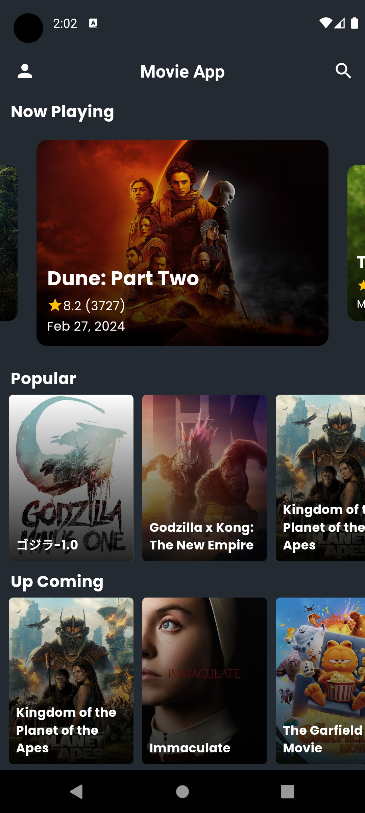
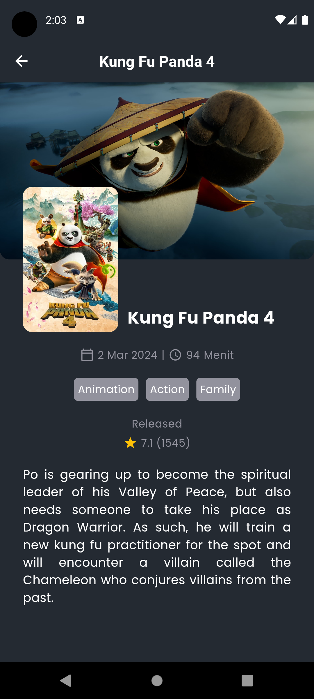
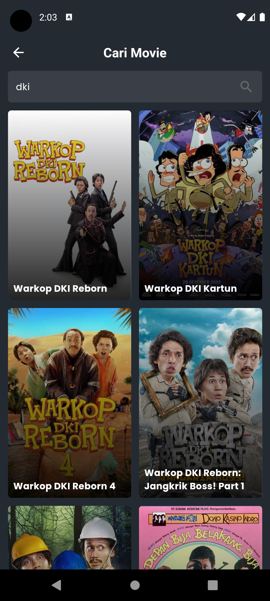
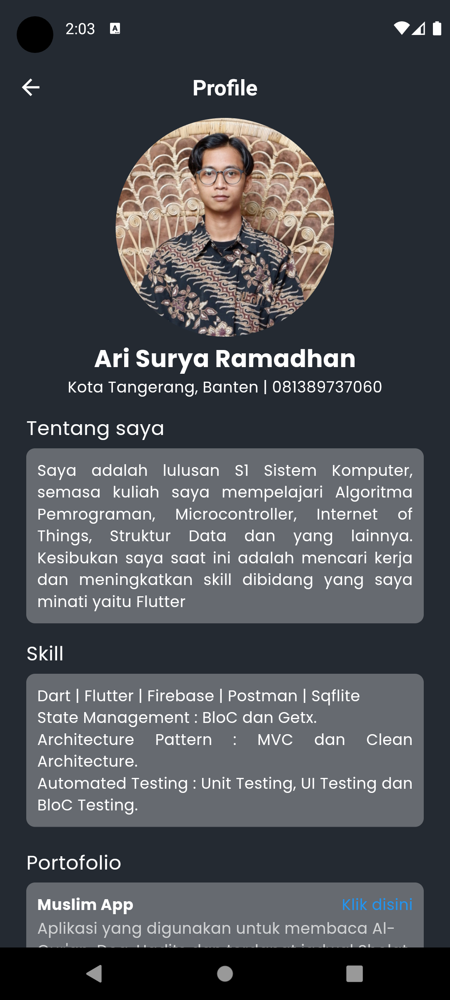

# Movie App

## Screenshots

  &nbsp;&nbsp;
  &nbsp;&nbsp;
  &nbsp;&nbsp;
  &nbsp;&nbsp;
  &nbsp;&nbsp;

### How To Run This Project
1. Extract Project
2. Flutter pub get in Terminal
3. Add ApiKey in lib\core\constant\urls.dart
4. Flutter run in Terminal

### How To Install Apk in Real Device
1. Extract Project
2. Get Apk in build\app\outputs\flutter-apk\app-release.apk
3. Copy to your Device (Smartphone / Android)
4. Install the Apk on your Device (Smartphone / Android)